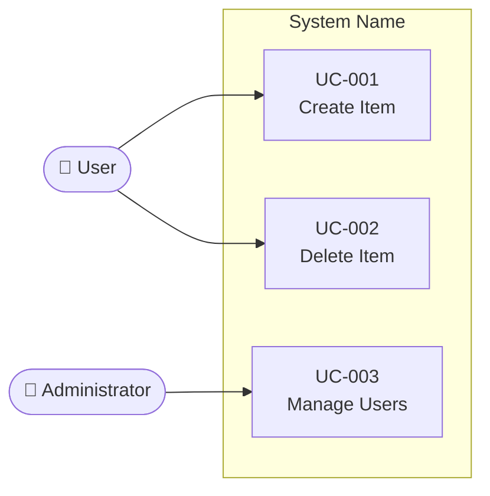

# Use Case Diagram

## Instructions

Create or update the Mermaid use case diagram at `docs/use_cases.md` based on `docs/requirements.md`.

## DO NOT

- Create diagrams without reading the requirements first
- Use PlantUML syntax
- Include implementation details in use case names
- Add actors that are not connected to any use case

## Template

````markdown
# Use Cases Overview


````

## Syntax Rules

- **Direction**: Always use `flowchart LR` (left to right)
- **Actors**: Use stadium shape with emoji: `actorId([emoji ActorName])`
  - Common emojis: 👤 User, 🔧 Admin, 🖥️ System, 📧 External Service
- **Use Cases**: Use rectangle shape: `UCxxx[UC-XXX\nDescription]`
- **System Boundary**: Use `subgraph "System Name"` to group use cases
- **Relationships**: Use `-->` arrows from actors to use cases
- **Node IDs**: Use `UC001`, `UC002` etc. (no hyphens) as node IDs
- **Labels**: Use `UC-001\nDescription` as display label (with hyphen)

## Conventions

- Each use case has a unique ID and a description
- Use Case ID: UC-{3-digit} (UC-001, UC-002, ...)
- Each use case should trace to at least one functional requirement
- Add notes sparingly, only where relationships need clarification

## Workflow

1. Read the requirements at `docs/requirements.md`
2. Read existing diagram at `docs/use_cases.md` (if exists)
3. Identify actors and use cases from requirements
4. Create/update the Mermaid use case diagram
5. Validate the diagram:
   - Each use case traces to at least one functional requirement in `docs/requirements.md`
   - All actors are connected to at least one use case
   - Use case IDs follow the UC-{3-digit} convention
   - Mermaid syntax is valid (proper `flowchart LR`, matching `subgraph`/`end`)
